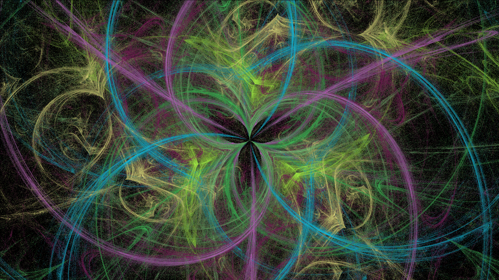

# Создание генератора фрактального пламени

В проекте реализован алгоритм генерации изображения фрактального пламени, основанного на идее Chaos Game.
Рализована однопоточная и многопоточная версия программы.

## Описание входных и выходных данных
### Входные данные
- Размеры изображения (ширина и высота)
- Количество итераций для генерации фрактала
- Список трансформационных функций и их параметры
- Поддержка симметрии
- Поддержка логарифмической гамма-коррекции
- Формат (PNG, JPEG)

### Выходные данные
- Изображение фрактального пламени
## Примеры изображений

